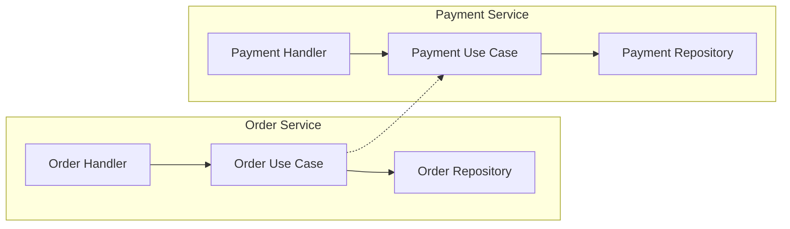

# Advanced Programming Assignment 1

## Architecture Overview

Order and Payment run as independent REST microservices with Clean Architecture boundaries.

- **Thin delivery layer** (Gin handlers) validates HTTP, parses `Idempotency-Key` headers, and forwards to use cases.
- **Use case layer** orchestrates business rules: `OrderUseCase` keeps payment logic isolated, `PaymentUseCase` enforces transaction limits and generates transactions.
- **Repository layer** owns PostgreSQL persistence per service (`order_db` and `payment_db`), keeping domain models framework-agnostic.



## Bounded Contexts

- **Order Service context**: knows `Order` lifecycle (`Pending` → `Paid`/`Failed`/`Cancelled`) and relies on an external payment evaluation through an interface (`PaymentClient`).
- **Payment Service context**: validates amounts (declining anything > 100,000 cents), records the `Payment`, and exposes the outcome.
- There is no shared package; each service keeps its own domain models and repositories.

## Failure Handling

- Payments are processed through a custom `http.Client` with a 2-second timeout. Any inability to reach or parse the payment response surfaces `ErrPaymentServiceUnavailable`.
- The Order handler translates that sentinel error into HTTP 503, marking the persisted order as `Failed` to keep operations idempotent and predictable.
- Idempotency is enforced via the `Idempotency-Key` header on `POST /orders`; repeated keys immediately return 409 without reprocessing.

## Running Locally

1. Ensure Docker (Compose v2) is installed.
2. From the project root run:

```
docker compose up --build
```

3. Compose spins up two Postgres 17 containers (`order-db`, `payment-db`), applies the SQL migrations, builds each Go service image, and exposes:

- `http://localhost:18080` → Order Service
- `http://localhost:18081` → Payment Service

4. Each service reads its database URL and any external base URL from environment variables (`ORDER_DB_URL`, `PAYMENT_DB_URL`, `PAYMENT_BASE_URL`). The Compose file wires these values so the containers connect over the service network while you can still hit the APIs from the host.

## Seed Data For Testing

PostgreSQL automatically runs all SQL files from each service's `migrations` folder on first DB initialization. The project now includes:

- `order-service/migrations/seed.sql` with ready-made orders in all lifecycle states (`Pending`, `Paid`, `Failed`, `Cancelled`).
- `payment-service/migrations/seed.sql` with both `Authorized` and `Declined` payments linked to seeded order IDs.

If containers were started before seed files were added, reset volumes once and recreate:

```bash
docker compose down -v
docker compose up --build
```

Quick checks after startup:

```bash
curl http://localhost:18080/orders/ORD-SEED-PAID-001
curl http://localhost:18080/orders/ORD-SEED-PENDING-001
curl http://localhost:18081/payments/ORD-SEED-PAID-001
curl http://localhost:18081/payments/ORD-SEED-FAILED-001
```

## API Surface & Testing

- The canonical API description lives in [`openapi.yaml`](openapi.yaml) and can be loaded into tools such as Postman or Swagger UI.
- Highlights:
  - `POST /orders` creates a `Pending` order, calls Payment, and updates the status to `Paid` or `Failed` depending on the payment response.
  - `GET /orders` returns all orders sorted by newest first.
  - `GET /orders/{id}` reads the order; `PATCH /orders/{id}/cancel` only allows cancellation when the order is still `Pending`.
  - `POST /payments` enforces a $1,000 limit (`100_000` cents) and returns either `Authorized` or `Declined`.
  - `GET /payments` returns all payments sorted by newest first.
  - `GET /payments/{order_id}` surfaces the payment stored for a specific order ID.

### Sample curl flows

```
curl -X POST http://localhost:18080/orders \
  -H "Content-Type: application/json" \
  -H "Idempotency-Key: new-order-1" \
  -d '{"customer_id":"cust-123","item_name":"widget","amount":1000}'

curl http://localhost:18080/orders

curl http://localhost:18080/orders/ORD-12345

curl -X PATCH http://localhost:18080/orders/ORD-12345/cancel

curl -X POST http://localhost:18081/payments \
  -H "Content-Type: application/json" \
  -d '{"order_id":"ORD-12345","amount":50000}'

curl http://localhost:18081/payments

curl http://localhost:18081/payments/ORD-12345
```

## OpenAPI & Architecture Diagram

The [`openapi.yaml`](openapi.yaml) file consolidates both services, their request/response schemas, and the error cases (409 for duplicates, 503 for payment outages, 400 for validation errors, etc.).

## Next Steps

1. Use the `openapi.yaml` definition to drive automated tests (Postman/Newman or Swagger-generated clients).
2. Monitor Docker Compose logs to confirm idempotent behavior, 503 handling, and wallet-limiting declines.
