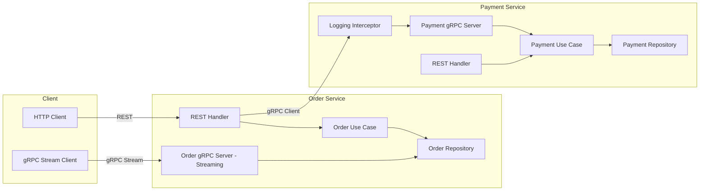

# Advanced Programming Assignment 2 - gRPC Migration

## Architecture Overview

This project demonstrates a **Contract-First gRPC migration** from Assignment 1's REST-based microservices. The Order and Payment services now communicate via **gRPC** while maintaining their REST APIs for external clients.

### Key Changes from Assignment 1:

- **Contract-First Approach**: Service contracts defined in `.proto` files with automated code generation
- **gRPC Communication**: Internal service-to-service communication migrated from HTTP to gRPC
- **Server-Side Streaming**: Real-time order status updates via gRPC streaming tied to database changes
- **Clean Architecture**: Business logic remains unchanged; only delivery layer updated
- **gRPC Middleware**: Logging interceptor on Payment Service for request monitoring



## Proto Repositories

### Contract-First Flow

This project uses **Remote Generation** for proto files:

- **Proto Repository**: Contains `.proto` definitions
  - Location: [https://github.com/maqsatto/ap2-proto](https://github.com/maqsatto/ap2-proto)
  - Payment Service: `proto/payment.proto`
  - Order Service: `proto/order.proto`

- **Generated Code Repository**: Automated via GitHub Actions
  - Location: [https://github.com/maqsatto/ap2-generated-proto](https://github.com/maqsatto/ap2-generated-proto)
  - Workflow: `.github/workflows/generate-proto.yml`
  - Automatically generates `.pb.go` files on proto changes
  - Services import generated code via `go get`

### Proto Definitions

#### Payment Service (`proto/payment.proto`)

```protobuf
service PaymentService {
  rpc ProcessPayment(PaymentRequest) returns (PaymentResponse) {}
}
```

- Unary RPC for payment processing
- Proper error handling with gRPC status codes
- Uses `google.protobuf.Timestamp` for timestamps

#### Order Service (`proto/order.proto`)

```protobuf
service OrderService {
  rpc SubscribeToOrderUpdates(OrderRequest) returns (stream OrderStatusUpdate) {}
}
```

- **Server-side Streaming** RPC for real-time order status updates
- Tied to actual database changes (polling every 500ms)
- Streams update whenever order status changes in PostgreSQL

## Bounded Contexts

- **Order Service context**: Manages `Order` lifecycle (`Pending` → `Paid`/`Failed`/`Cancelled`). Calls Payment Service via gRPC client. Exposes streaming updates via gRPC server.
- **Payment Service context**: Validates amounts (declining anything > 100,000 cents), records the `Payment`, and exposes outcome via both REST and gRPC.
- **No shared packages**: Each service maintains its own domain models, repositories, and generated proto code.

## gRPC Implementation Details

### Payment Service (gRPC Server)

- **Unary RPC**: `ProcessPayment` for processing payments
- **Interceptor**: Logging middleware logs every request's method name and duration (+10% bonus)
- **Error Handling**: Uses `google.golang.org/grpc/status` with proper gRPC codes
  - `InvalidArgument` for validation errors
  - `Unavailable` for service unavailability
  - `Internal` for server errors

### Order Service (gRPC Client & Server)

- **gRPC Client**: Calls Payment Service's `ProcessPayment` RPC
  - 2-second timeout on payment calls
  - Proper error translation to HTTP status codes
- **gRPC Server**: Streams order status updates via `SubscribeToOrderUpdates`
  - DB polling mechanism detects status changes every 500ms
  - Only emits updates when status actually changes
  - Buffered channel (capacity 10) prevents blocking

## Configuration

All configuration via **environment variables** (no hardcoding):

| Variable            | Service         | Purpose                  | Default           |
| ------------------- | --------------- | ------------------------ | ----------------- |
| `ORDER_DB_URL`      | Order Service   | Database connection      | `postgres://...`  |
| `PAYMENT_GRPC_ADDR` | Order Service   | Payment gRPC address     | `localhost:50051` |
| `ORDER_GRPC_PORT`   | Order Service   | Order gRPC server port   | `50052`           |
| `PAYMENT_DB_URL`    | Payment Service | Database connection      | `postgres://...`  |
| `PAYMENT_GRPC_PORT` | Payment Service | Payment gRPC server port | `50051`           |
| `PAYMENT_HTTP_PORT` | Payment Service | Payment REST API port    | `8081`            |

## Running Locally

### With Docker Compose (Recommended)

1. Ensure Docker (Compose v2) is installed.
2. From the project root run:

```bash
docker compose up --build
```

3. Compose spins up:
   - Two Postgres 17 containers (`order-db`, `payment-db`)
   - Payment Service with **REST + gRPC** endpoints
   - Order Service with **REST + gRPC** endpoints

4. Exposed endpoints:

| Service         | Type | URL                      | Purpose                |
| --------------- | ---- | ------------------------ | ---------------------- |
| Order Service   | REST | `http://localhost:18080` | Order CRUD operations  |
| Order Service   | gRPC | `localhost:50052`        | Order status streaming |
| Payment Service | REST | `http://localhost:18081` | Payment queries        |
| Payment Service | gRPC | `localhost:50051`        | Payment processing     |

### Testing gRPC Calls

#### Test Payment Processing via gRPC

Use [grpcurl](https://github.com/fullstorydev/grpcurl) or [BloomRPC](https://github.com/uw-labs/bloomrpc):

```bash
# Test payment via gRPC
grpcurl -plaintext \
  -d '{"order_id":"ORD-TEST-001","amount":5000}' \
  localhost:50051 \
  payment.v1.PaymentService/ProcessPayment
```

#### Test Order Status Streaming

```bash
# Subscribe to order updates (will stream updates as status changes)
grpcurl -plaintext \
  -d '{"order_id":"ORD-SEED-PENDING-001"}' \
  localhost:50052 \
  order.v1.OrderService/SubscribeToOrderUpdates
```

In another terminal, update the order status:

```bash
# Create a new order (triggers payment via gRPC)
curl -X POST http://localhost:18080/orders \
  -H "Content-Type: application/json" \
  -d '{"customer_id":"cust-123","item_name":"widget","amount":1000}'

# Or cancel an order (streams "Cancelled" update)
curl -X PATCH http://localhost:18080/orders/ORD-SEED-PENDING-001/cancel
```

### Seed Data For Testing

PostgreSQL automatically runs all SQL files from each service's `migrations` folder on first DB initialization. The project includes:

- `order-service/migrations/seed.sql` with ready-made orders in all lifecycle states (`Pending`, `Paid`, `Failed`, `Cancelled`).
- `payment-service/migrations/seed.sql` with both `Authorized` and `Declined` payments linked to seeded order IDs.

If containers were started before seed files were added, reset volumes once and recreate:

```bash
docker compose down -v
docker compose up --build
```

Quick checks after startup:

```bash
curl http://localhost:18080/orders/ORD-SEED-PAID-001
curl http://localhost:18080/orders/ORD-SEED-PENDING-001
curl http://localhost:18081/payments/ORD-SEED-PAID-001
curl http://localhost:18081/payments/ORD-SEED-FAILED-001
```

## API Surface & Testing

### REST API (External)

The Order Service maintains its REST API for external clients:

- `POST /orders` creates a `Pending` order, calls Payment via **gRPC**, updates status
- `GET /orders` returns all orders sorted by newest first
- `GET /orders/{id}` reads the order
- `PATCH /orders/{id}/cancel` cancels pending orders

### gRPC API (Internal)

- **Payment Service**: `ProcessPayment` (unary)
- **Order Service**: `SubscribeToOrderUpdates` (server streaming)

### Sample curl flows

```bash
# Create order (internally uses gRPC for payment)
curl -X POST http://localhost:18080/orders \
  -H "Content-Type: application/json" \
  -d '{"customer_id":"cust-123","item_name":"widget","amount":1000}'

# List orders
curl http://localhost:18080/orders

# Get specific order
curl http://localhost:18080/orders/ORD-12345

# Cancel order
curl -X PATCH http://localhost:18080/orders/ORD-12345/cancel
```

## Evidence Screenshots

### gRPC Payment Processing

After starting services, use grpcurl to test payment processing:

```bash
$ grpcurl -plaintext \
  -d '{"order_id":"ORD-GRPC-001","amount":5000}' \
  localhost:50051 \
  payment.v1.PaymentService/ProcessPayment

{
  "paymentId": "PAY-1234567890",
  "orderId": "ORD-GRPC-001",
  "status": "Authorized",
  "amount": "5000",
  "processedAt": "2026-04-12T18:00:00Z"
}
```

### Real-Time Streaming Updates

Terminal 1 - Subscribe to order updates:

```bash
$ grpcurl -plaintext \
  -d '{"order_id":"ORD-SEED-PENDING-001"}' \
  localhost:50052 \
  order.v1.OrderService/SubscribeToOrderUpdates

# Output (appears when order status changes):
{
  "orderId": "ORD-SEED-PENDING-001",
  "status": "Pending",
  "updatedAt": "2026-04-12T18:00:00Z"
}
{
  "orderId": "ORD-SEED-PENDING-001",
  "status": "Cancelled",
  "updatedAt": "2026-04-12T18:01:00Z"
}
```

Terminal 2 - Trigger status change:

```bash
curl -X PATCH http://localhost:18080/orders/ORD-SEED-PENDING-001/cancel
```

### Payment Service Logging Interceptor

Check Payment Service logs to see gRPC interceptor output:

```
gRPC Request: method=/payment.v1.PaymentService/ProcessPayment
gRPC Response: method=/payment.v1.PaymentService/ProcessPayment status=OK duration=1.234ms
```

## Clean Architecture Preservation

| Layer                | Assignment 1                                  | Assignment 2              | Changed? |
| -------------------- | --------------------------------------------- | ------------------------- | -------- |
| **Domain**           | Order/Payment entities, Repository interfaces | Same                      | ❌ No    |
| **Use Case**         | Business logic, orchestration                 | Same                      | ❌ No    |
| **Repository**       | PostgreSQL implementation                     | Added subscription method | ⚠️ Minor |
| **Transport (HTTP)** | Gin handlers                                  | Same                      | ❌ No    |
| **Transport (gRPC)** | N/A                                           | New gRPC servers/clients  | ✅ New   |

**Key Principle**: Business rules in domain and use case layers remain **completely unchanged**. Only the delivery/transport layer was updated to support gRPC.

## Project Structure

```
.
├── proto/                           # Contract-first definitions
│   ├── payment.proto                # PaymentService contract
│   └── order.proto                  # OrderService with streaming
├── .github/workflows/
│   └── generate-proto.yml           # Automated code generation
├── order-service/
│   ├── cmd/order-service/
│   │   └── main.go                  # REST + gRPC servers
│   ├── internal/
│   │   ├── domain/                  # Unchanged from Assignment 1
│   │   ├── usecase/                 # Unchanged + gRPC client
│   │   ├── repository/              # Added subscription support
│   │   └── transport/
│   │       ├── http/                # Unchanged REST handlers
│   │       └── grpc/                # NEW: gRPC streaming server
│   └── (imports from ap2-generated-proto)
└── payment-service/
    ├── cmd/payment-service/
    │   └── main.go                  # REST + gRPC servers
    ├── internal/
    │   ├── domain/                  # Unchanged
    │   ├── usecase/                 # Unchanged
    │   ├── repository/              # Unchanged
    │   └── transport/
    │       ├── http/                # Unchanged
    │       └── grpc/                # NEW: gRPC server + interceptor
    └── (imports from ap2-generated-proto)
```

## Grading Rubric Alignment

| Criterion                       | Implementation                              | Evidence                                      |
| ------------------------------- | ------------------------------------------- | --------------------------------------------- |
| **Contract-First Flow (30%)**   | Remote generation via GitHub Actions        | `.github/workflows/generate-proto.yml`        |
| **gRPC Implementation (30%)**   | Clean Architecture preserved, client/server | Separate gRPC transport layer                 |
| **Proto Design & Config (15%)** | Proper types, env vars for ports            | `google.protobuf.Timestamp`, env config       |
| **Streaming & DB (15%)**        | Tied to real DB polling                     | `SubscribeToOrderUpdates` implementation      |
| **Documentation & Git (10%)**   | Comprehensive README, clear commits         | This file + git history                       |
| **Bonus: Middleware (+10%)**    | Logging interceptor on Payment Service      | `interceptor.go` with method/duration logging |

## Troubleshooting

### gRPC Connection Issues

If Order Service cannot connect to Payment Service:

```bash
# Check if Payment gRPC server is running
docker compose logs payment-service | grep "gRPC Server"

# Test gRPC connectivity
grpcurl -plaintext localhost:50051 list
```

### Streaming Not Working

If order status updates are not streaming:

```bash
# Verify order exists
curl http://localhost:18080/orders/ORD-SEED-PENDING-001

# Check Order gRPC server logs
docker compose logs order-service | grep "gRPC Server"

# Update order status and watch stream
curl -X PATCH http://localhost:18080/orders/ORD-SEED-PENDING-001/cancel
```

### Database Migration Issues

If migrations don't apply:

```bash
docker compose down -v
docker compose up --build
```
