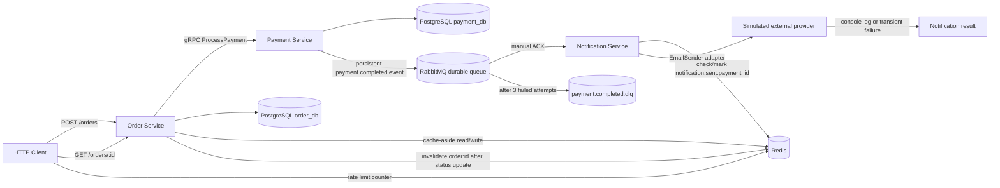

# Assignment 4 Architecture

The Order Service uses Redis for cache-aside reads and the bonus API rate limiter. The Notification Service is a background worker: it consumes RabbitMQ jobs, uses Redis for idempotency, and calls an `EmailSender` adapter so provider logic is outside the worker flow.
