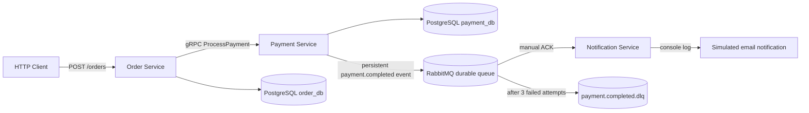

# Assignment 3 Architecture

```mermaid
flowchart LR
    Client[HTTP Client] -->|POST /orders| Order[Order Service]
    Order -->|gRPC ProcessPayment| Payment[Payment Service]
    Order --> OrderDB[(PostgreSQL order_db)]
    Payment --> PaymentDB[(PostgreSQL payment_db)]
    Payment -->|persistent payment.completed event| Broker[(RabbitMQ durable queue)]
    Broker -->|manual ACK| Notification[Notification Service]
    Broker -->|after 3 failed attempts| DLQ[(payment.completed.dlq)]
    Notification -->|console log| EmailLog[Simulated email notification]
```

The Notification Service depends only on RabbitMQ and the payment event JSON schema. It does not call Order Service or Payment Service.
